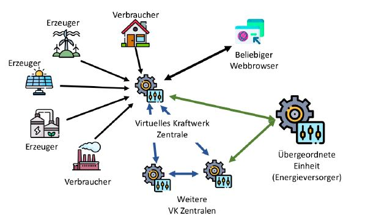

Powercenter-Simulation

## About The Project

As part of the distributed systems course, an application from the field "power generation/powerplants" is to 
be developed. The following technologies are to be used: Sockets, RPC (Apache Thrift, gRPC / Protobuf) and Message-Oriented Middleware (MQTT).



## Built With

- C++
- Docker
- Make

## Getting Started

1. Clone the repo
    ```sh
    git@github.com:katja-kova/powercenter-simulation.git
    ```
2. Build the project
    ```sh ./build.sh```
    
3. Start docker containers
   ```sh
   docker-compose up
    ```
4. Check the data in the browser under `localhost/history`

### License

Distributed under the GNU General Public License. See `LICENSE` for more information.
